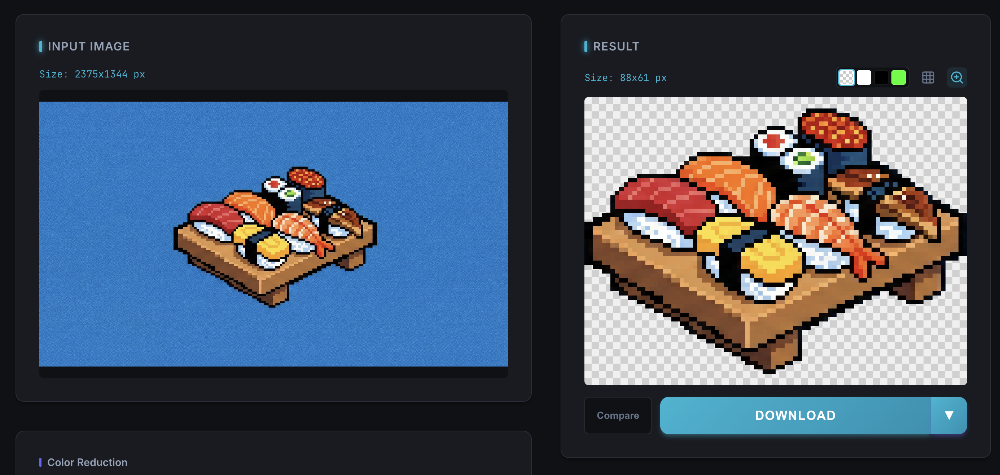

# Pixel Refiner（像素精修器）

[English](./README.md) | [日本語](./README.ja.md)



**Pixel Refiner** 是一款免费工具，用来清理像素画（特别是 AI 生成的像素画）。它可以去除模糊边缘、找到真正的像素网格、把背景变透明等等。一切都在你自己电脑的浏览器里运行，无需上传。


## 在你的电脑上运行

只需要安装 [Node.js](https://nodejs.org/)（LTS 版本）。

**1. 获取代码**

- 使用 Git：`git clone https://github.com/yukirtxreal-ctrl/pixel-refiner.git`
- 或者点击本页绿色的 **Code** 按钮，选择 **Download ZIP**，然后解压。

**2. 启动应用**

- **Windows：** 双击 `start-app.bat`。
- **macOS：** 双击 `start-app.command`（第一次需要右键选择"打开"）。
- **Linux / 终端：**

```
npm install
npm run dev
```

应用会在 `http://localhost:5173` 打开。使用期间请保持终端窗口开着，关闭它应用就会停止。

**出问题了？** Windows 下双击 `fix-and-start.bat`，它会重新安装所有依赖并重新启动。

**构建独立版本：** 运行 `npm run build`，文件会生成到 `dist/`。用任意静态服务器托管该文件夹（例如 `npx serve dist`）。不要直接从文件系统打开 `index.html` —— 图像处理运行在 Web Worker 中，浏览器会在 `file://` 下阻止它。

## 功能

- **去除抗锯齿** —— 模糊的边缘变回干净、锐利的像素。
- **识别像素网格** —— 检测真实像素大小并按此缩放。四种模式：自动 / 提示 / 强制 / 关闭 (1:1)。默认保持像素为正方形，画面不会被压扁或拉伸。
- **背景透明化** —— 自动识别或用吸管选色。强度可调，可清理孔洞和杂散像素，还有"保留主体"选项。
- **减色** —— 高质量减色（Oklab + K-means）、复古主机调色板（NES、Game Boy、PICO-8、SFC 风格等）、抖动算法（Floyd-Steinberg、Bayer、Ordered）。
- **描边**、**自动裁剪空白**、**按 2 倍到 32 倍导出**、**批量处理多张图片**（打包 ZIP 下载）、**预设保存**。

## 附加工具

在应用内的"工具"面板打开：

- **照片 → 像素画** —— 把任意照片变成像素画。
- **精灵表** —— 把精灵表切成单帧，或把多张图片打包成一张图集（支持 TexturePacker JSON / Aseprite JSON / Godot SpriteFrames / CSV）。
- **调色板 / 重上色** —— 提取、导出、替换调色板。内置 PICO-8、Sweetie 16、DawnBringer、Endesga 32 等经典调色板。
- **动画工作室** —— 导入 GIF 或 APNG，一键精修所有帧，预览后导出为 GIF、APNG、单帧或精灵表。
- **修补编辑器** —— 手动修像素：铅笔、橡皮、填充、取色、撤销/重做，还有能找回被背景移除误删部分的"还原画笔"。
- **无缝检查** —— 检查图块平铺时是否有可见接缝。
- **图块热图** —— 显示哪些图块的颜色数超过复古主机的限制。
- **复制设置链接** —— 把当前设置变成链接分享。

完整变更列表见 [WHATS_NEW.md](./WHATS_NEW.md)。

## 使用方法

1. 把一张或多张图片拖进应用。
2. 点击 **Process**（或打开 **Auto**）。
3. 按需调整设置：网格检测、颜色、背景、描边。
4. 用 **Compare** 对比处理前后。
5. 点击 **Download** 保存；多张图片用 **Download All (ZIP)**。

## 开发

使用 TypeScript + Vite 构建。需要 Node.js 24 或更高版本。

```
npm install     # 安装依赖
npm run dev     # 开发服务器 (http://localhost:5173)
npm run build   # 生产构建 (dist/)
npm test        # 运行单元测试
```

## 项目结构

- `src/browser/` —— 用户界面
- `src/core/` —— 图像处理（网格检测、重采样、透明化、动画等）
- `src/utils/` —— 调色板导入导出辅助
- `src/shared/` —— 共享类型与配置
- `test/` —— 测试图片与用例

## 致谢与许可

基于 Happy Onigiri 的 [PixelRefiner](https://github.com/HappyOnigiri/PixelRefiner)。以 [MIT 许可证](./LICENSE)发布。
